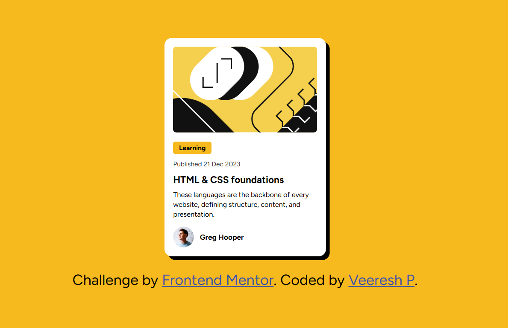

# Frontend Mentor - Blog Preview Card Solution

This is my solution to the [Blog preview card challenge on Frontend Mentor](https://www.frontendmentor.io/challenges/blog-preview-card-ckPaj01IcS). It helped me sharpen my HTML and CSS fundamentals while experimenting with layout, typography, and visual polish.

---

## Table of Contents

- [Overview](#overview)
  - [The Challenge](#the-challenge)
  - [Screenshot](#screenshot)
  - [Links](#links)
- [My Process](#my-process)
  - [Built With](#built-with)
  - [What I Learned](#what-i-learned)
  - [Continued Development](#continued-development)
  - [Useful Resources](#useful-resources)
- [Author](#author)

---

## Overview

### The Challenge

Users should be able to:

- View a clean, responsive blog card layout
- See hover and focus states for interactive elements
- Appreciate visual feedback and typography choices

### Screenshot




### Links

- [Solution URL](https://github.com/Veereshp984/Blog-preview-card)
- [Live Site URL](https://veereshp984.github.io/Blog-preview-card/)

---

## My Process

### Built With

- Semantic HTML5
- CSS3 (custom properties, Flexbox)
- Responsive design principles
- Font integration using `@font-face`
- Visual enhancements (box-shadow, hover effects)

### What I Learned

- How to center elements using Flexbox
- How to apply custom fonts using `@font-face`
- How to create dense, modern shadows with `box-shadow`
- How to structure a clean, responsive layout using mobile-first design

```css
#main {
  box-shadow: 0 15px 30px rgba(0, 0, 0, 0.3);
  border-radius: 10px;
}
```

```html
@font-face {
  font-family: 'MyCustomFont';
  src: url('./assets/fonts/my-font.woff2') format('woff2');
}
```

### Continued Development

- Improve accessibility with better focus indicators
- Add animation on hover for smoother transitions
- Explore using CSS Grid for more complex layouts
- Build a reusable card component in React

### Useful Resources

- [CSS Box Shadow Generator](https://cssmash.com/css-box-shadow-generator) – helped me fine-tune shadow depth
- [MDN Web Docs](https://developer.mozilla.org/en-US/) – my go-to for CSS and HTML references
- [Frontend Mentor Discord](https://discord.gg/frontendmentor) – great community for feedback and support

---

## Author
- Frontend Mentor – [@veeresh](https://www.frontendmentor.io/profile/Veereshp984)
- Twitter – [@veeru_rp](https://x.com/veeru_rp)

---

## Acknowledgments

Thanks to the Frontend Mentor community for inspiration and feedback. Special shoutout to the challenge creators for such a clean and fun design to build!

---

